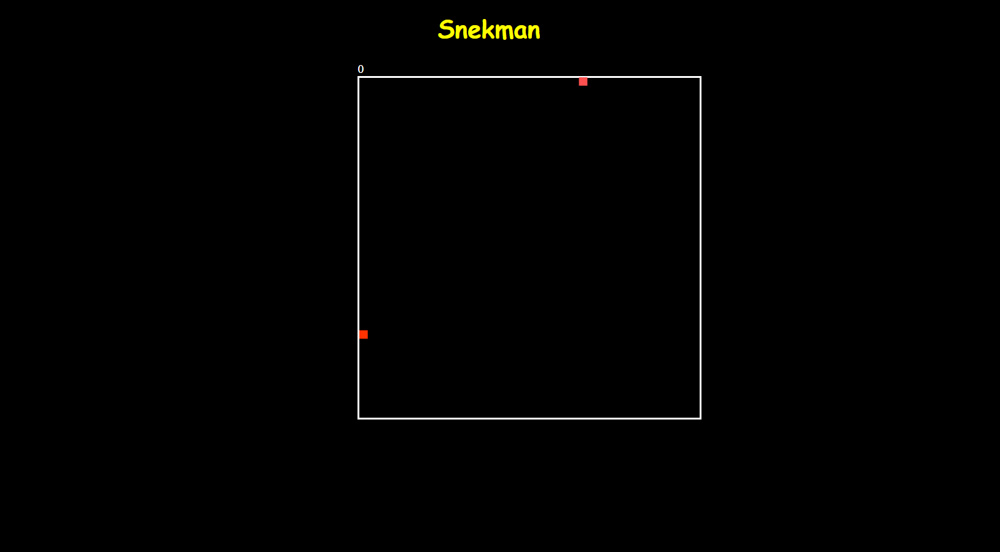

# snekman

A small game where the goal is to eat as much as you can.

## Getting Started




### Prerequisites

@github link .


## How To

When you open the page the Snekman will automatically start moving.
The other red dot is the food our dot wants to eat.
You can use your arrows on the keyboard to control him and take it all!

### App Code

Explain what these tests test and why

```JS
(function setup() {
    snek = new Snek();
    eten = new fruit();
    eten.pickLocation();

    window.setInterval(() => {
        ctx.clearRect(0, 0, canvas.width, canvas.height);
        eten.draw();
        snek.update();
        snek.draw();

        if (snek.eat(eten)) {
            eten.pickLocation();
        }
    }, 100);
}());
```
```JS
window.addEventListener('keydown', ((evt) => {
    const direction = evt.key.replace('Arrow', '');
    snek.changeDirection(direction);
}))
```

### Snek Code

Explain what these tests test and why

```JS
function Snek() 
    this.x = 0;
    this.y = 0;
    this.xSpeed = scale * 1;
    this.ySpeed = 0;
```
```JS
this.draw = function() {
        ctx.fillStyle = "#ff5050";
        ctx.fillRect(this.x, this.y, scale * 2, scale * 2);
    }
```
```JS
this.update = function() {
        this.x += this.xSpeed;
        this.y += this.ySpeed;
        if (this.x > canvas.width) {
            this.x = 0;
        }
        if (this.y > canvas.height) {
            this.y = 0;
        }
        if (this.x < 0) {
            this.x = canvas.width;
        }
        if (this.y < 0) {
            this.y = canvas.height;
        }
    }
```
```JS
this.changeDirection = function(direction) {
        switch(direction) {
            case 'Up':
                this.xSpeed = 0;
                this.ySpeed = -scale * 1;
                break;
            case 'Down':
                this.xSpeed = 0;
                this.ySpeed = scale * 1;
                break;
            case 'Left':
                this.xSpeed = -scale * 1;
                this.ySpeed = 0;
                break;
            case 'Right':
                this.xSpeed = scale * 1;
                this.ySpeed = 0;
                break;                                         
        }
    }
```
```JS
this.eat = function(eten) {
        if (this.x === eten.x && this.y === eten.y) {
            return true;
        }
        return false;
    }
}
```
### Food Code

Explain what these tests test and why

```JS
function fruit() {
    this.x;
    this.y;
    this.pickLocation = function() {
        this.x = (Math.floor(Math.random() * rows - 1) + 1) * scale;
        this.y = (Math.floor(Math.random() * columns - 1) + 1) * scale;
    }
    this.draw = function() {
        ctx.fillStyle = "#ff3300";
        ctx.fillRect(this.x, this.y, scale * 2, scale * 2)
    }
}
```


## Deployment

Add additional notes about how to deploy this on a live system


## Contributing

Loosely based on [Code With Kris](https://www.youtube.com/watch?v=21eSpMtJwrc&t=659s)
 

## Authors

* **Kenneth Van Der Strieckt** - *Initial work* - [Snekman](https://github.com/KennethVDS/snekman)


## Acknowledgments

* Hat tip to anyone whose code was used
* Inspiration
* etc
